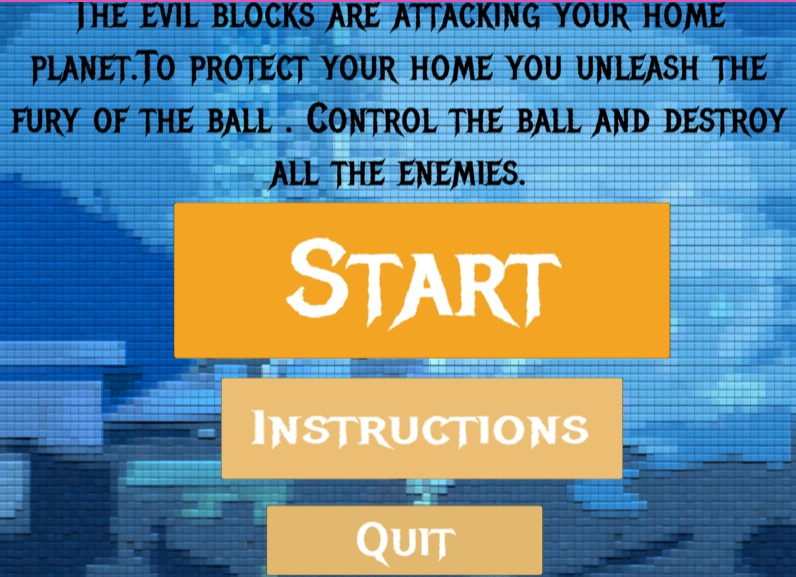
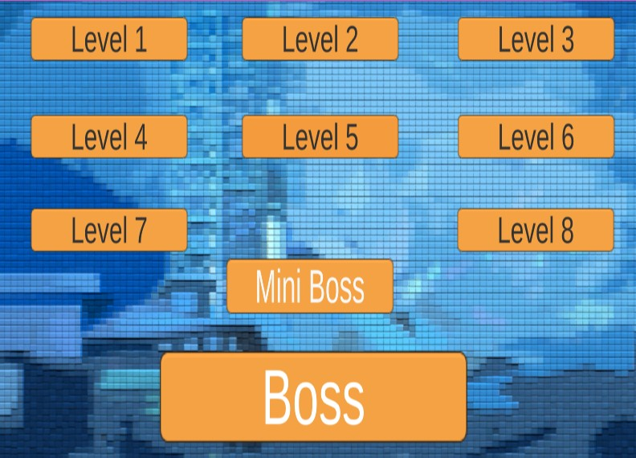
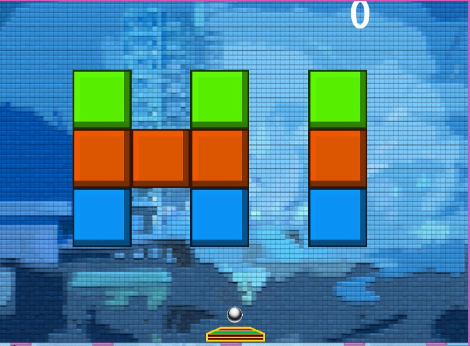
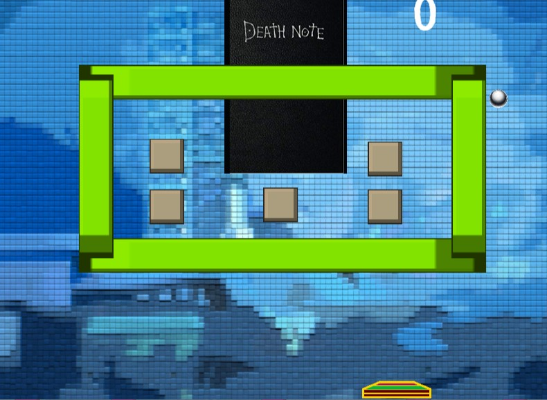
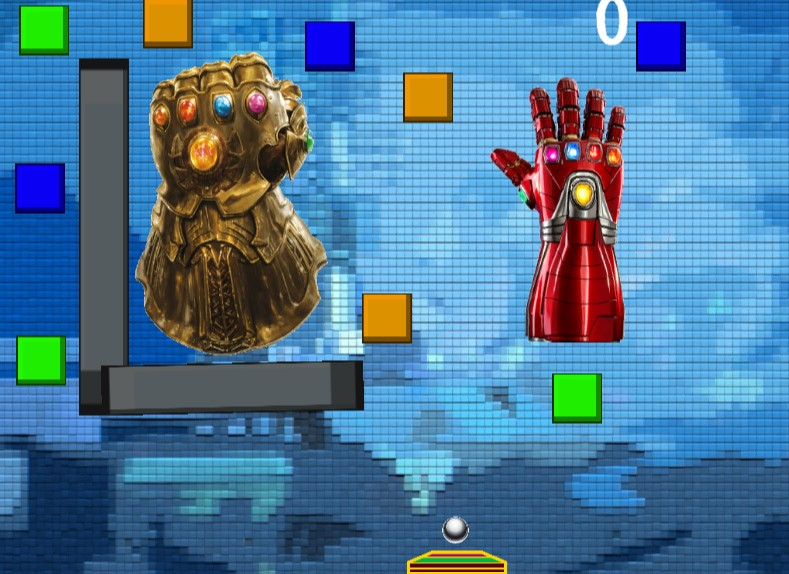

# Rampage of the Ball

 
 

## **Deployment Link** : [Click here](https://swift1989.itch.io/rampage-of-the-ball)

<!-- ABOUT THE PROJECT -->
## **About The Project**
A game based on the famous arcade game brick breaker.

 
## **Key features**
1. 10 levels with increasing difficulty
2. Last two levels incorporate unique mechanics
3. Sound effects
4. Score system
5. Speed changes to adjust difficulty
6. In-game sprite change

### **Tech Stack used**

* [Unity](https://unity.com/)
* [Unity WebGL](https://docs.unity3d.com/Manual/webgl-building.html)

 

### **Installation**
The upload is done in accordance with following guide, it also contains information on how to install from git
 
[Guide](https://unityatscale.com/unity-version-control-guide/how-to-setup-unity-project-on-github/)

 

## **Screenshots**

 
Homepage 

    
Level Select Menu 

    
First Level 

    
Miniboss level 

    
Boss level 

    

 

 

<!-- CONTACT -->
### **Contact**
Harsh Yadav - harshyadavhappy@gmail.com

 
